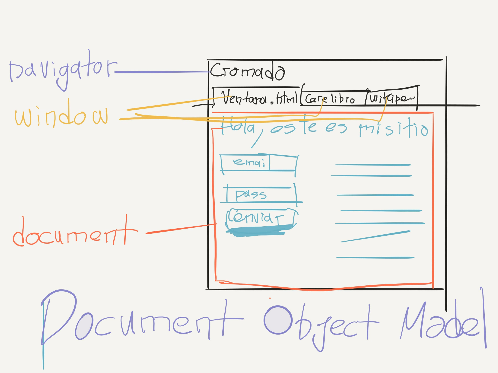
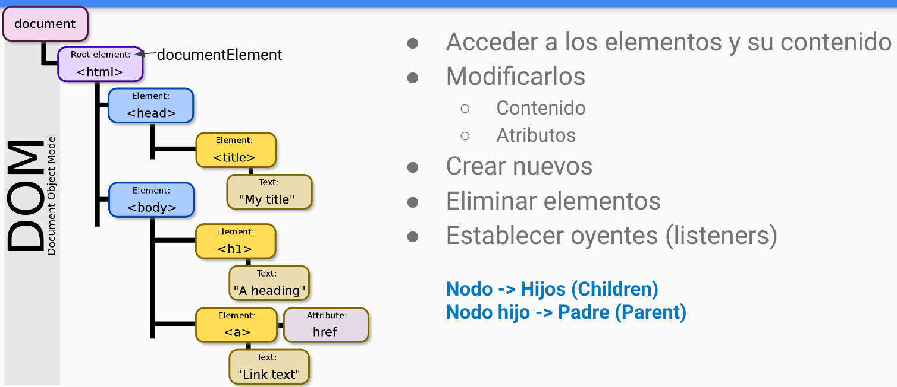

# La ventana y el documento

Hasta el momento hemos estado trabajando con varias herramientas características del lenguaje; variables, constantes, if...else, if...else..if, switch, ciclo while, do...while, y for.

A demás de algunas funcionalidades como **console.log**, **prompt**, **alert**, **confirm**.

## La ventana

Recordemos que JavaScript es ejecutado por el navegador, adicionalmente, el navegador aísla el contexto de un sitio del de otros.
Así cada sitio está contenido en una ventana (**window**), también conocida como pestaña. Pensemos en esta como un contenedor que nos proporciona algunas funcionalidades y acceso a algunas características, y lo tenemos accesible desde JS con la palabra reservada **window**.

Ejecuta **console.log(window)**  para que explores lo que tenemos dentro de este.

Todas las funcionalidades que usamos, están definidas dentro de **window**, y por defecto, sin hacer referencia a window, tenemos acceso a estas y otras funcionalidades y características; **window.console.log, es equivalente a console.log**.

## El documento

Una de las características proporcionadas por window, es la propiedad **document**.

**El documento**, una referencia al contenido del **.html**. Es una abstracción que nos permite ver lo que tenemos en la página de una manera programática, y le llamamos **Document Object Model (DOM)**.

El DOM nos permite hacer todo esto usando JavaScript:

